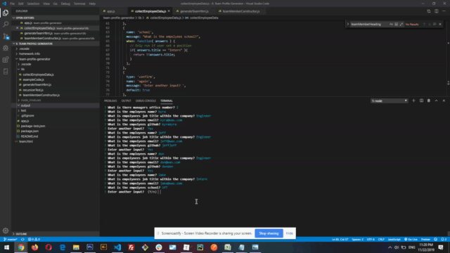

# Profile-Generator
Assignment 8 

This assignment focused on creating a command-line application that dynamically generates a HTML webpage for a team such as in a business setting. 
The team is comprised of a manager and any number os engineers and interns decided during the cli generation step.

